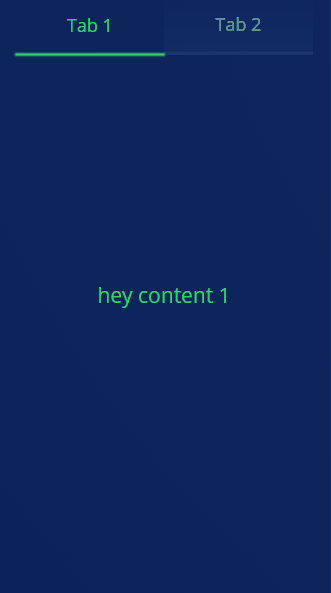

# react-cool-tabs

Very comfortable package to use tabs.<br />
I looked for a tabs package that i can custom each tab and content the way i want.<br />
for example different borderBottom on each tab.<br />
i didn't find so i made this.<br />
Enjoy.<br />




## Installation

     npm i react-cool-tabs --save

## Usage

```jsx
import  React  from  'react';
import CoolTabs from 'react-cool-tabs';

class Content1 extends Component {
  render() {
    return <div style={style}>
      this is Content1
    </div>
  }
}
class Content2 extends Component {
  render() {
    return <div style={style}>
      this is Content2
    </div>
  }
}

export  default  class  Example  extends  React.Component {
render() {
   return (
     <div>
	     <CoolTabs
	       tabKey={'1'}
	       style={{ width:  550, height:  500, background:  'white' }}
	       activeTabStyle={{ background:  'red', color:  'white' }}
	       unActiveTabStyle={{ background:  'green', color:  'black' }}
	       activeLeftTabBorderBottomStyle={{ background:  'blue', height:  4 }}
	       activeRightTabBorderBottomStyle={{ background:  'yellow', height:  4 }}
	       tabsBorderBottomStyle={{ background:  'orange', height:  4 }}
	       leftContentStyle={{ background:  'lightgreen' }}
	       rightContentStyle={{ background:  'lightblue' }}
	       leftTabTitle={'Left title'}
	       rightTabTitle={'Right title'}
	       leftContent={<Content1/>}
	       rightContent={<Content2/>}
	       contentTransitionStyle={'transform 0.6s ease-in'}
	       borderTransitionStyle={'all 0.6s ease-in'}/>
     </div>
);
}}
```

## Props

Some propStyles has also classNames, so you can use them in a css file.
 
|props| type | classNames | Description|
|-----|--|--|--|
|style|object|className|The style of the Container. <br />the default is width: 400, height: 400|
|tabsHeaderStyle|object|tabsHeaderClassName|The style of the tabs part default here is height: 40|
|activeTabStyle|object|activeTabClassName|The active tab style, u can also give style to the title font|
unActiveTabStyle|object|unActiveClassName| The Unactive tab style, u can also give style to the title font
leftTabStyle|object|leftTabClassName| The left tab style only if you want different style for each tab.<br /> **<small>activeTabStyle and unActiveTabStyle is stronger than this!</small>**| 
rightTabStyle|object|rightTabClassName| The right tab style only if you want different style for each tab.<br /> **<small>activeTabStyle and unActiveTabStyle is stronger than this!</small>**| 
leftTabTitleStyle|object|leftTabTitleClassName|The left title style if you want to give each title different style
rightTabTitleStyle|object|rightTabTitleClassName|The right title style if you want to give each title different style
leftTabTitle|string|leftTabTitle|Left title name
rightTabTitle|string|rightTabTitle|Right title name
tabsBorderBottomStyle|object|tabsBorderBottomClassName|the border under the tabs|
activeLeftTabBorderBottomStyle|object|activeLeftTabBorderBottomClassName|border under the **left** tab if active|
activeRightTabBorderBottomStyle|object|activeRightTabBorderBottomClassName|border under the **right** tab if active|
contentContainerStyle|object|contentContainerClassName| Recommended just if you want to make the backgroundColor a gradient on both tabs **content** , else you can use leftContentStyle, and rightContentStyle
leftContentStyle|object|leftContentClassName|The left content style|
rightContentStyle|object|rightContentClassName|the right content style|
leftContent|component/text/img|-|The content you want to have when you on the left tab|
rightContent|component/text/img|-|The content you want to have when you on the right tab|
contentTransitionStyle|string|-|the speed and type of transition.<br />**example:** 'transform 0.6s ease-in' <br />**has to start with the word 'transition'!**|
borderTransitionStyle|string|-|The border transition style.<br /> **example:**  'all 0.6s ease'<br />**has to start with the word 'all'!**|
